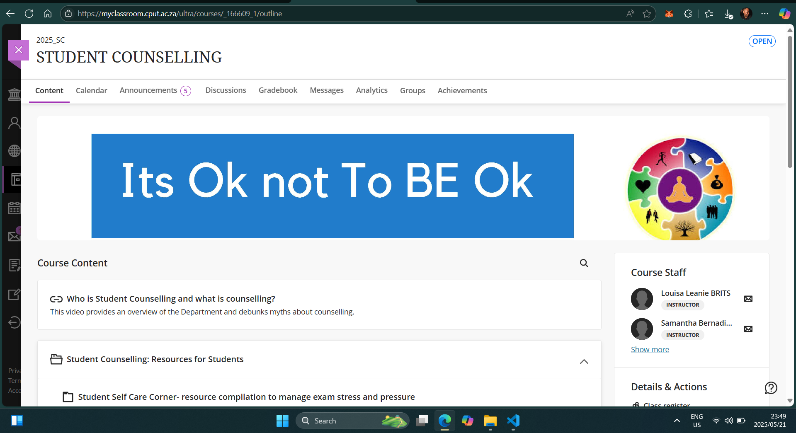
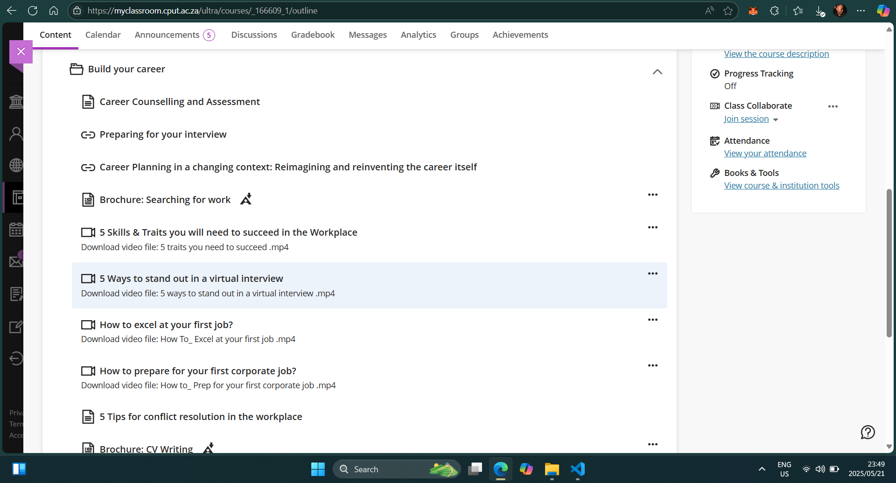

# 🌟 Digital Portfolio  

My name is **Lehlogonolo Mahlangu**, and my student number is **221569618**. I am currently a student at the **Cape Peninsula University of Technology**, where I am pursuing a **Diploma in ICT: Application Development**.

This digital portfolio is a reflection of the skills, knowledge, and experiences I have gained during the **Work Readiness Training** program. It includes both **evidence of participation** and **reflections** written using the **STAR Technique** (Situation, Task, Action, Result), aimed at demonstrating my readiness for the professional environment.

The portfolio is organized into the following key sections:
- **Career Counselling** – includes proof of engagement and a STAR-based reflection on the experience.
- **Skills and Interests** – highlights my core competencies and passions, along with a structured reflection.
- **Personality Assessment** – features insights from my personality test and what I’ve learned from it.
- **Curriculum Vitae (CV)** – presents my professional CV and the process behind its development.
- **CV Submission** – includes details of the submission process and a reflection on the feedback received.

Each section of this portfolio is designed to showcase both my practical achievements and personal growth throughout the program. I invite you to explore the content to learn more about my development journey.

Thank you for taking the time to visit my portfolio.

---

## 🎯 Career Counselling

### 📁 Evidence

As part of the Work Readiness Training, I participated in a series of career counselling activities hosted through the CPUT Student Counselling platform. The programme emphasized the importance of mental well-being with resources like *“It’s OK not to be OK”*, and included a comprehensive module titled **"Career Counselling and Assessment"**.

In addition, I engaged with several learning materials under the **"Build Your Career"** section. These included:
- Career Planning in a Changing Context
- 5 Skills and Traits You Will Need to Succeed in the Workplace
- 5 Ways to Stand Out in a Virtual Interview
- How to Excel at Your First Job
- How to Prepare for Your First Corporate Job
- Conflict Resolution in the Workplace

These resources provided me with practical knowledge and strategies for navigating interviews, building a professional profile, and preparing for success in the workplace.

### ✨ Reflection (STAR Technique)

**S – Situation:**  
At the beginning of the career counselling programme, I felt uncertain about how to approach my transition from student life to the working world. I had limited understanding of what employers look for and how to present myself confidently during job applications and interviews.

**T – Task:**  
My task was to actively engage with the student counselling resources, complete the modules, and reflect on how I could apply the skills and insights to my personal career journey.

**A – Action:**  
I attended the sessions available through the online platform and carefully reviewed materials such as "Career Planning in a Changing Context", the "5 Skills and Traits to Succeed" video, and "5 Ways to Stand Out in a Virtual Interview". I also made notes, participated in discussions where applicable, and reflected on how these topics applied to me as an aspiring software developer.

**R – Result:**  
As a result of this experience, I now feel more confident in my career direction and better prepared to market myself effectively. I understand the importance of self-awareness, adaptability, and emotional intelligence in the workplace. I also developed a clearer career vision, with realistic expectations and strategies to achieve my goals.

## 🔧 Skills and Interests

### 🧾 Evidence

I completed the "Skills and Interests" module, where I explored values, skillsets, transferable skills, and how these impact career decisions. I achieved a perfect score of **100/100**, demonstrating full engagement and understanding.

### 🌟 Reflection (STAR Technique)

**S - Situation:**  
During the Work Readiness Training, I was enrolled in a module focusing on skills and interests.

**T - Task:**  
The task involved identifying my key skills, understanding what values are, and how they influence career choices.

**A - Action:**  
I worked through each section of the module and reflected on how my values and interests align with careers in ICT, particularly in application development.

**R - Result:**  
I completed the module with a perfect score and developed a clearer understanding of how my personal attributes can be leveraged for career success.

## Personality Assessment  
**Lehlogonolo Gledwin Mahlangu**

The **Personality Assessment** was one of the most eye-opening components of my self-development journey. Understanding how personality traits align with specific career paths allowed me to think critically about where I fit best in the professional world. This module didn't just test knowledge—it offered a mirror into who I am and how that translates into the workplace.

### Why It Mattered

Personality plays a foundational role in job satisfaction, productivity, and long-term career success. Through this assessment, I recognized tendencies that influence my behavior, preferences for work environments, and how I interact in teams or leadership roles. I now have a clearer picture of how I can align my natural inclinations with career opportunities that will allow me to thrive.

---

### STAR Reflection

- **Situation:** I was tasked with completing a personality-based career matching assessment that explores the intersection of individual traits and vocational outcomes.
  
- **Task:** My objective was to evaluate various personality types and their associated career paths, then reflect on which ones most closely aligned with my personal characteristics.
  
- **Action:** I carefully analyzed each question, drawing from both the course material and personal introspection. I avoided rushing through the task and instead used it as a real opportunity to explore how my traits influence my potential roles in the workforce.
  
- **Result:** I successfully completed the assessment with a score of **80/100**, indicating a strong understanding of the content and its application. The assessment was completed in a focused and efficient **3 minutes and 28 seconds**. Most importantly, I walked away with valuable self-awareness that will inform my career choices moving forward.

---

### Key Takeaways

- I discovered that I resonate with both **Realistic** and **Conventional** personality types.
- I realized that careers requiring systematic problem-solving and analytical reasoning appeal to me.
- The exercise also helped me understand why I work best in environments with structure and clarity.

---

.png)

---
